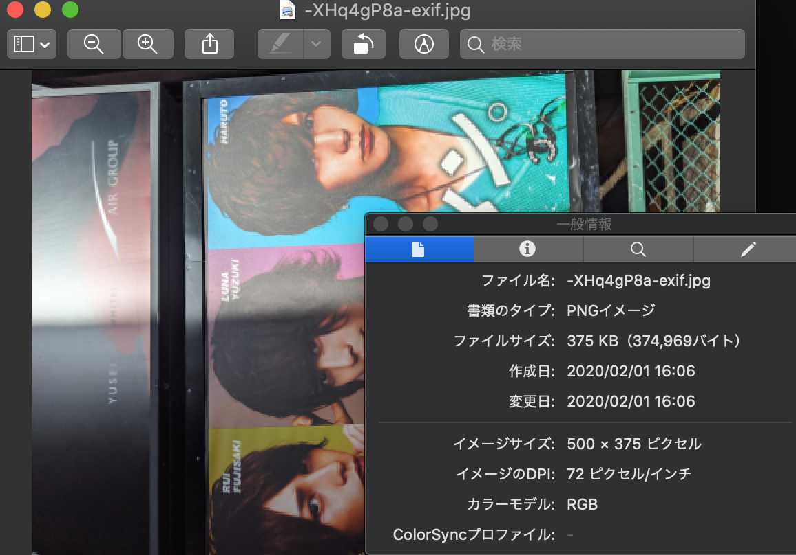

# shinjukumokumoku #84

---

## 予実

- [x] AM~15:00 Elasticsearch のお仕事
  - 検索できた。あとは sort と limit。
- Instagram 風 SNS アプリケーション(Andpresent)の開発
  - アップロードした jpeg が実は png だった問題の修正
  - WIP: exif をみて rotate する

---

## Elasticsearch のお仕事

- 特に問題なし
- Elastica、良いライブラリです

---

## Andpresent

- 吉崎さんがだいぶやってくれた

---

## 問題

---

## file type

- canvas の toBlob の第 2 引数で file type を指定
- file type はオリジナルのファイル名に従う
  - const ext = file.name.split(".").pop();

---

## rotate

- https://github.com/exif-js/exif-js でやる
- 泥臭くバイナリみてる…!

---

## 終わり
